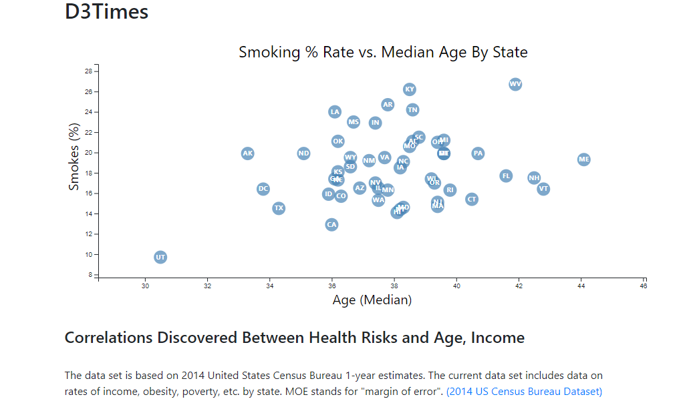

## D3.js Project - Visualizing Data with D3.js

## Table of contents
* [Project_Background](##Project_Background)
* [Project_Task](##Project_Task)
* [Technologies](##Technologies)
* [Setup](##setup)
* [Methodology](##Methodology)


## Project_Background

This project is to create data visualizations using D3. The task is to visualize the health risks facing particular demographics. The data used to create the charts is based on 2014 ACS 1-year estimates (https://factfinder.census.gov/faces/nav/jsf/pages/searchresults.xhtml). The current data set incldes data on rates of income, obesity, poverty, etc. by state. MOE stands for "margin of error."

## Project_Task
* To create a D3 static scatter plot chart (example shown below) between two of the data variables such as Healthcare vs. Poverty.  In this project, I also attempted to create a more dynamic scatter plot. (To review dynamic scatter plot in action, review point #3 under Methodology).  


## Technologies
The project is created with:
* D3js==5.16.0
* Bootstrap==4.3.1

## Setup
1. To download the latest version of d3.js or to link directly to the latest release (https://d3js.org/) 

## Methodology

1. Wrote code to create D3 scatterplot (To review code, review app.js file under Code/assets/js folder)

   We created a D3 scatterplot that used Age vs Smoke%.
   * Included state abbreviations in the circles.
   * Implemented tooltip with d3-tip that shows the State name, median age and smoke rate when you hover on a specific circle on the scatterplot.

2. To visualize static scatterplot

   Open index.html.  &nbsp; Below is a snapshot of the final chart.

    

3. To visualize dynamic scatterplot (To review code, review appBonusAll.js file)
    * Included more demographics and more risk factors.
    * Placed additional labels in the scatter plot on both y and x axes and gave them click events so that users can decide which data to display. 
    * Animated the transitions for circles' locations as well as the range of axes. 
    * To visualize dynamic scatterplot: Open index.html file:  

        * Comment out the following code:
        ```javascript
        <script type="text/javascript" src="assets/js/app.js"></script>
        ```
        * Uncomment the following code, save the file and run it:  
        ```javascript
        <script type="text/javascript" src="assets/js/appBonusAll.js"></script> 

    * Below is an example of the dynamic scatterplot created:

        
